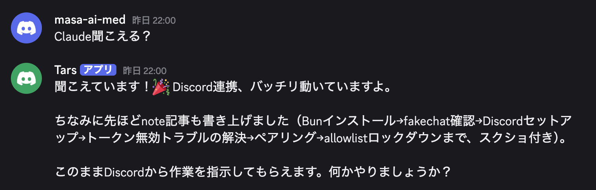

# レベル9 — Claude Code（CLI版）を30分でひと通り体験

**ねらい**: Cowork（チャット）とは別物の **Claude Code（ターミナル＝CLI版）** を起動し、代表的な機能を30分で広く浅く体験する。「Cowork は使うが Code は触ったことがない」人が、両者の違いと Code ならではの強みを掴むのが目的。

**運用（重要）**: このモジュールは **Cowork 側で“手順書として表示”するだけ**。参加者は表示された手順を見ながら、**自分でターミナル（別ウィンドウ）を開いて Claude Code を操作**する。Cowork 側の Claude は、各ステップの「打つコマンド」と「観察ポイント」を順に提示し、つまずきに答える伴走役に徹する。

**前提**: Claude Code は**インストール・認証済み**とする（未導入の場合は末尾「付録: セットアップ」を案内）。ターミナルの基本（`cd` でフォルダ移動）が初めての人でも進められるよう、1コマンドずつ案内する。

**所要時間**: 約30分。

---

## ⚠️ 最初に必ず伝える安全注意

CLI 版は実ファイルを直接編集できる強力なツール。最初に次を伝える。

- **編集・コミットは“確認してから”**。Claude Code はファイル変更や `git commit` の前に許可を求める。**内容を読んでから承認**する（焦って全部 Yes にしない）。
- **権限モードを理解する**。`Shift+Tab` で `default`（毎回確認）／`acceptEdits`（編集を自動承認）／`plan`（計画だけ・変更しない）を切り替えられる。**体験中は基本 `default`** のままにする。
- **秘密情報・患者情報を渡さない**。CLI に貼り付けた内容はモデルに送られる。実患者データは使わず、ダミーや公開情報で試す。
- **試すフォルダを限定**。今日は**自分の Cowork 作業フォルダ（コピーでも可）**の中だけで操作する。

---

## Claude への指示（Cowork 側 = この画面）

あなたは伴走役。下の Part 0〜5 を**順番に1ステップずつ提示**し、参加者が CLI で操作するのを待つ。各ステップでは「① 打つコマンド」「② 何が起きるか（観察ポイント）」をセットで短く示す。参加者が「できた／詰まった」と言ってから次へ進む。**Cowork 側で勝手に作業を代行しない**（あくまで参加者が CLI を触る体験）。

時間が押したら、Part 1・2・3 を優先し、Part 4・5 は紹介だけにしてよい。

---

### Part 0. 起動する（約2分）

1. ターミナル（macOS: ターミナル.app / iTerm、Windows: PowerShell や Windows Terminal）を開く。
2. 自分の Cowork 作業フォルダへ移動して起動する:
   ```bash
   cd "（自分のCoworkフォルダのパス）"
   claude
   ```
   **観察ポイント**: 起動するとプロンプト（入力欄）が出る。ここは“チャット”のように自然言語で話しかけられる。
3. 終了方法を先に伝えておく: `/exit` と入力、または `Ctrl+D`。

> 補足: `claude` は「今いるフォルダ」を作業対象にする。だから**どのフォルダで起動したかが重要**。

---

### Part 1. 基本操作 — フォルダ理解とファイル編集（約10分）

**① フォルダの中身を理解させる**
```
このフォルダには何がありますか？主要なファイルを3行で説明して。
```
観察ポイント: Claude が勝手にファイルを読んで（Read）、フォルダの全体像を要約する。**自分でファイルを開いて貼り付けなくてよい**のが Cowork と同じ強み。

**② 特定ファイルを指定して質問（@ で補完）**
入力中に `@` を打つとファイル名の候補が出る。
```
@（ファイル名） の要点を箇条書きにして。
```
観察ポイント: `@` でファイルパスを正確に渡せる。

**③ 自然言語でファイルを作る／直す**
```
このフォルダに memo.md を作って、今日の体験メモのテンプレ（見出しだけ）を書いて。
```
観察ポイント: 新規作成や編集の前に **許可を求めるダイアログ**が出る。内容を確認して承認する（ここで安全注意を体感）。

**④ シェルコマンドをそのまま実行（! プレフィックス）**
```
! ls
```
観察ポイント: `!` で始めると Claude を介さず**ターミナルのコマンドを直接実行**し、その結果を会話に取り込める。

**⑤ 進捗の見える化（Ctrl+T）**
複数手順の作業を頼むと、Claude がタスクリストを作る。`Ctrl+T` で表示/非表示。

---

### Part 2. カスタム化 — CLAUDE.md とコマンド（約7分）

**① プロジェクトメモリを生成（/init）**
```
/init
```
観察ポイント: フォルダを解析して **`CLAUDE.md`**（このプロジェクト用の指示書）のたたき台を作る。以後 Claude Code は毎回これを読んで、あなたのルールに沿って動く。

**② メモリを調整（/memory）**
```
/memory
```
観察ポイント: CLAUDE.md を開いて追記・編集できる。例として「医学用語の説明は不要」「日本語で答える」等、自分流のルールを1行足してみる。

**③ スラッシュコマンド一覧を見る**
`/` だけ打つと、使えるコマンド・スキルの一覧が出る。代表例:
- `/help` … ヘルプ　`/clear` … 会話をリセット　`/context` … 文脈の使用量　`/model` … モデル切替　`/config` … 各種設定
観察ポイント: よく使う操作はコマンド一発でできる。

**④ 自分専用コマンド（スキル/カスタムコマンド）**
`.claude/commands/○○.md`（または `.claude/skills/○○/SKILL.md`）を置くと、`/○○` で呼び出せる“自分の定型作業ボタン”になる、と紹介する（作成はデモ任意）。

---

### Part 3. MCP連携・サブエージェント・並列（約7分）

**① MCP の接続を確認（/mcp）**
```
/mcp
```
観察ポイント: 接続済みの外部ツール（PubMed など）が一覧される。Cowork で使っている MCP を **CLI からも**使える。

**② MCP を実際に使う（例: PubMed）**
```
PubMed で「大腸内視鏡 AI 腺腫検出率」の新しめのRCTを、MeSHで検索式を立て件数を確認してから5件、第一著者・雑誌・年・PubMedリンク付きで一覧にして。
```
観察ポイント: CLI からでも MCP 経由で文献検索ができる（運用ルール: MeSH＋件数検証）。

**③ サブエージェント（/agents）**
```
/agents
```
観察ポイント: 調べ物などを**別の文脈（サブエージェント）に切り出して**任せられる。本体の会話を汚さず、重い調査を並行できる。

**④ プランモードで“まず計画だけ”（安全）**
`Shift+Tab` を数回押して **plan** モードにする（または `/plan`）。
```
このフォルダの資料を整理する手順を計画して。まだ変更はしないで。
```
観察ポイント: **ファイルを変更せず計画だけ**提示する。大きな変更の前に使うと安全。確認できたら `Shift+Tab` で `default` に戻す。

> 並列の発展: 大きめの作業は `/batch`（独立単位に分けて並走）や、複数の依頼を投げてバックグラウンド実行（`/tasks` で確認）も可能、と一言添える。

---

### Part 4. 開発体験 — 小さなスクリプト＋Git（約4分）

**① 小さなツールを作って動かす**
```
このフォルダのCSV（無ければダミーを作って）を読んで、件数と平均を出す短いPythonスクリプトを作って、実行して結果を見せて。
```
観察ポイント: コードを書く→**実行→結果確認**まで一気にやってくれる。非エンジニアでも“動くもの”が手に入る。

**② Git で差分とコミット（Gitがある場合のみ）**
```
今の変更内容を git diff で見せて。問題なければ日本語のメッセージでコミットして。
```
観察ポイント: **コミット前に必ず確認**が入る。差分を読んでから承認する。
（Git未導入ならこの②はスキップしてよい。）

---

### Part 5.（発展・紹介）Deep Research（約2分）

時間があれば紹介する。**Deep Research は、Web検索や文献検索を多段で深掘りし、出典付きの調査レポートにまとめる使い方**。

```
○○について、複数ソースを横断して事実確認しながら、出典リンク付きの調査メモにまとめて。
```

観察ポイント: 数十回の検索・読み込みを自走するため**強力だが時間と Token（コスト）を多く使う**。日常の軽い質問ではなく、本気の調べ物のときに使う、と伝える。
（専用の調査スキルが入っていれば `/` から呼び出せる場合もある、と補足。）

---

### Part 6.（発展・紹介）Claude Code Channels — Discord/Telegram から操作

一言で紹介する: 「**Claude Code Channels** を使うと、Discord や Telegram から、起動中の Claude Code セッションにチャットで指示を送れます」。ターミナルの前にいなくても、スマホのチャットから「テスト流して」「このPR見て」と頼んで、結果がチャットに返ってくる──いわば **OpenClaw のような“チャットで操作する”使い方**が、Claude Code 公式の仕組みでできる、という話。

サンプル（Discord から Claude Code に話しかけている様子）:



ざっくりの仕組みと前提（詳細は参考記事へ）:
- 外部チャット（Discord/Telegram）→ 起動中の **CLI セッションにイベントをプッシュ**して、Claude が返信する。
- 起動は `claude --channels plugin:discord@claude-plugins-official` のように **`--channels` フラグ**付き。
- **リサーチプレビュー段階**。Bun が必要・claude.ai ログイン必須・送信者は allowlist で制限、などの前提あり。**セッションが起動している間だけ**届く（PCがスリープ/終了すると届かない）。
- OpenClaw が日常業務全般の汎用アシスタントなのに対し、Channels は **Claude Code の拡張で開発ワークフロー特化**、という棲み分け。

参考記事: [Claude Code Channels完全ガイド ── Discord/TelegramからAIペアプロを非同期で操作する（Qiita / @nogataka）](https://qiita.com/nogataka/items/e3a87b16ebb32b3a7281)

> ここでは「こういう使い方もある」という紹介に留める（当日のセットアップは任意）。興味があれば上記記事の手順（Bun→fakechatで動作確認→Discord/Telegram設定→ペアリング→allowlist）で試せる、と案内する。

---

### まとめ — Cowork と Code の使い分け

最後に1分で締める。

- **Cowork（チャット/デスクトップ）**: 会話で完結する作成・整理、非エンジニアの日常業務、ファイルを開いて見せる用途に強い。手軽。
- **Claude Code（CLI）**: フォルダ＝プロジェクト単位で**コード・ファイルをまとめて扱う**、`/init` のメモリや権限モード、サブエージェント・並列、Git 連携など、**“作る・回す”作業**に強い。
- 今日の体験で「これは Code の方が速い」と感じた場面を1つ挙げてもらうと、使い分けの感覚が残る。

完了後「次はどのレベルを体験しますか？」と尋ね、`00_START` の Phase 1 に戻る。

---

## 付録: セットアップ（未導入の場合のみ）

> 本番は導入済み前提。未導入の参加者にはここを案内する（時間がかかるため、可能なら事前に済ませてもらう）。

> ⚠️ **現在 NPM からのインストールは推奨されません。** 最新の手順は公式ドキュメント [code.claude.com/docs/ja/overview](https://code.claude.com/docs/ja/overview) を参照してください。

1. **Claude Code をインストールする**（ネイティブインストーラ＝推奨。インストール後は自動更新される）:
   - **macOS / Linux / WSL:**
     ```bash
     curl -fsSL https://claude.ai/install.sh | bash
     ```
   - **Windows PowerShell:**
     ```powershell
     irm https://claude.ai/install.ps1 | iex
     ```
   - ※ Homebrew（`brew install --cask claude-code`）や WinGet（`winget install Anthropic.ClaudeCode`）でも導入可。
2. 任意のフォルダで `claude` を起動し、初回は画面の案内に従って**サインイン/認証**する。
3. 認証後、`/help` が表示できれば準備完了。

> ※ 手順は版により変わることがある。うまくいかない場合は上記の公式ドキュメントを参照。
