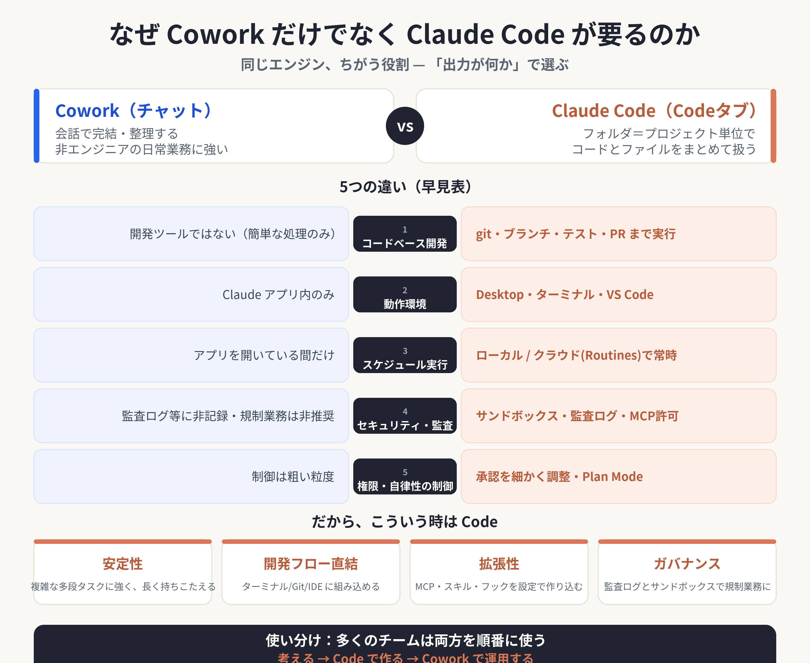

# レベル9 — Claude Code（Desktop版）を30分でひと通り体験



> **まず上の図で「なぜ Code か？」を1分で共有する。** Cowork と Claude Code は同じエンジン・同じエージェントの仕組みを共有する“別の役割”。Cowork（チャット）は会話で完結する作成・整理に強く、Claude Code はフォルダ＝プロジェクト単位で**コードとファイルをまとめて扱い**、git・テスト・権限制御・拡張・監査まで踏み込める。**「Cowork で十分」な場面も多いが、複雑な多段タスク・開発フロー・再現性・ガバナンスが要る場面では Code が要る**——この使い分けの感覚を掴むのが今日のねらい。

**ねらい**: Cowork（チャット）と同じ Claude Desktop アプリ内にある **「Code」タブ（＝Claude Code Desktop）** を開き、代表的な機能を30分で広く浅く体験する。「Cowork は使うが Code は触ったことがない」人が、両者の違いと Code ならではの強みを掴むのが目的。

**運用（重要）**: 参加者は**自分の Claude Desktop アプリで「Code」タブを開いて操作**する。今いる Cowork 側の Claude は、各ステップの「やること」と「観察ポイント」を順に提示し、つまずきに答える**伴走役**に徹する（Cowork 側で勝手に作業を代行しない）。ターミナルを別途立ち上げる必要はなく、**同じアプリのタブを切り替えるだけ**で始められるのが Desktop 版の良いところ。

**前提**: Claude Desktop アプリ（Pro / Max / Team / Enterprise のいずれか）に**サインイン済み**で、**「Code」タブが使える**こと（未導入・未表示の場合は末尾「付録: セットアップ」を案内）。Windows は初回に **Git for Windows** が必要。

**所要時間**: 約30分。

---

## ⚠️ 最初に必ず伝える安全注意

Code タブは実ファイルを直接編集できる強力なツール。最初に次を伝える。

- **編集は“確認してから”承認する**。最初は **Ask permissions（確認）モード**のまま使い、Claude が出す**差分（diff）を読んでから**承認する（焦って全部 Accept しない）。
- **権限モードを理解する**。送信ボタン横の**モードセレクタ**（`Cmd/Ctrl + Shift + M`）で、`Ask permissions`（毎回確認）／`Auto accept edits`（編集を自動承認）／`Plan mode`（計画だけ・変更しない）などを切り替えられる。**体験中は基本 `Ask permissions`** のまま。`Bypass`（全スキップ）は使わない。
- **秘密情報・患者情報を渡さない**。入力した内容はモデルに送られる。実患者データは使わず、ダミーや公開情報で試す。
- **試すフォルダを限定**。今日は**自分の Cowork 作業フォルダ（コピーでも可）**だけを Project folder に選ぶ。Git リポジトリならセッションごとに隔離コピー（worktree）が作られるので、他の作業に影響しにくい。

---

## Claude への指示（Cowork 側 = この画面）

あなたは伴走役。下の Part 0〜5 を**順番に1ステップずつ提示**し、参加者が Code タブで操作するのを待つ。各ステップでは「① やること（どこを押す／何を入力する）」「② 何が起きるか（観察ポイント）」をセットで短く示す。参加者が「できた／詰まった」と言ってから次へ進む。**Cowork 側で勝手に作業を代行しない**（あくまで参加者が Code タブを触る体験）。

時間が押したら、Part 1・2・3 を優先し、Part 4・5 は紹介だけにしてよい。

---

### Part 0. セッションを始める（約2分）

1. Claude Desktop アプリの上部タブで **「Code」** をクリックする（Chat / Cowork / Code の3タブ構成。Code は開発用）。
2. プロンプト欄の上で**4つを設定**してから最初のメッセージを送る:
   - **Environment**: `Local`（自分のPCで動かす）を選ぶ。
   - **Project folder**: 自分の **Cowork 作業フォルダ** を選ぶ。
   - **Model**: 送信ボタン横のドロップダウンから選ぶ（既定のままでよい）。
   - **Permission mode**: モードセレクタで **`Ask permissions`** を選ぶ。
3. 試しに最初のメッセージを送ってみる:
   ```
   このフォルダで作業を始めます。まずフォルダの中身を確認してください。
   ```
   **観察ポイント**: サイドバーに**セッション**が1つでき、そのセッションが「自分のチャット履歴・プロジェクトフォルダ・コード変更」を**独立して**持つ。ターミナルを開かなくても、チャットのように自然言語で話しかけられる。

> 補足: Code タブは**「セッション」単位**で動く。サイドバーの **＋ New session**（`Cmd/Ctrl + N`）で、別フォルダ・別タスクのセッションを**並行**して持てる。

---

### Part 1. 基本操作 — フォルダ理解とファイル編集（約10分）

**① フォルダの中身を理解させる**
```
このフォルダには何がありますか？主要なファイルを3行で説明して。
```
観察ポイント: Claude が勝手にファイルを読んで（Read）、フォルダの全体像を要約する。**自分でファイルを開いて貼り付けなくてよい**のが Cowork と同じ強み。

**② 特定ファイルを指定して質問（@ で補完）**
プロンプト欄で `@` を打つとファイル名の**候補（オートコンプリート）**が出る。
```
@（ファイル名） の要点を箇条書きにして。
```
観察ポイント: `@` でファイルを正確に文脈へ渡せる。Desktop ではドラッグ＆ドロップや、`＋` ボタンからの**ファイル添付（画像・PDF）**もできる。

**③ 自然言語でファイルを作る／直す**
```
このフォルダに memo.md を作って、今日の体験メモのテンプレ（見出しだけ）を書いて。
```
観察ポイント: 新規作成や編集の前に **差分（diff）を見せて許可を求める**。内容を確認して **Accept** する（ここで安全注意を体感）。

**④ 変更を「差分ビュー」で確認する**
ファイルが変わると、`+12 -1` のような**差分インジケータ**が出る。クリックすると**差分ビュー**が開き、ファイルごとに変更を確認できる。
```
（差分ビューの行をクリックしてコメントを書き）この見出しを日本語に直して。
```
観察ポイント: 差分の**行にコメント**を付けて Claude に直させる、という GUI ならではのレビュー往復ができる（Cmd/Ctrl+Enter でまとめて送信）。CLI の `git diff` を読むより直感的。

**⑤ 進捗の見える化（タスク／ビュー）**
複数手順の作業を頼むと、Claude が裏でタスクや**サブエージェント**を走らせる。セッションツールバーの **Views** メニューから **Tasks** ペインなどを開くと、進行中の作業が見える。

---

### Part 2. カスタム化 — CLAUDE.md とスキル（約7分）

**① プロジェクトメモリを生成（/init）**
プロンプト欄で `/` を打つと使えるコマンド・スキルの一覧が出る。`/init` を選んで送る:
```
/init
```
観察ポイント: フォルダを解析して **`CLAUDE.md`**（このプロジェクト用の指示書）のたたき台を作る。以後 Code も Cowork も毎回これを読んで、あなたのルールに沿って動く。**この CLAUDE.md は CLI 版とも共有**される。

**② メモリを調整する**
生成された `CLAUDE.md` をチャットのリンクからクリックして**ファイルペイン**で開き、`Save` で直接編集できる。例として「医学用語の説明は不要」「日本語で答える」等、自分流のルールを1行足してみる。
```
CLAUDE.md に「回答は必ず日本語で」を追記して。
```

**③ スラッシュコマンド／スキル一覧を見る**
`/` だけ打つ、または **＋ ボタン → Slash commands** で、使える**コマンド・スキル**の一覧が出る。代表例:
- `/help` … ヘルプ　`/compact` … 文脈を要約して空ける　`/btw` … サイド質問（後述）
観察ポイント: よく使う操作はコマンド一発でできる。Cowork で入れたスキルも**そのまま Code から呼べる**。

**④ 自分専用スキル（カスタムスキル／プラグイン）**
`.claude/skills/○○/SKILL.md` を置くと `/○○` で呼び出せる“自分の定型作業ボタン”になる、と紹介する。Desktop では **＋ ボタン → Plugins** から、ターミナルを使わずにプラグインの追加・有効化もできる（作成・追加はデモ任意）。

---

### Part 3. MCP連携・サイド質問・Plan モード（約7分）

**① MCP（コネクタ）の接続を確認する**
**＋ ボタン → Connectors** を開く。
観察ポイント: 接続済みの外部ツール（PubMed・Google・Slack・GitHub など）が一覧される。Cowork で使っている MCP / コネクタを **Code タブからも**使える（CLI の `/mcp` に相当する操作が GUI でできる）。

**② MCP を実際に使う（例: PubMed）**
```
PubMed で「大腸内視鏡 AI 腺腫検出率」の新しめのRCTを、MeSHで検索式を立て件数を確認してから5件、第一著者・雑誌・年・PubMedリンク付きで一覧にして。
```
観察ポイント: Code タブからでも MCP 経由で文献検索ができる（運用ルール: MeSH＋件数検証）。

**③ サイド質問で本筋を汚さない（/btw）**
`Cmd/Ctrl + ;` または `/btw` で**サイドチャット**を開く。
```
（サイドチャットで）今の差分の意味を初心者向けに説明して。
```
観察ポイント: セッションの文脈を**読んだまま**、本体の会話に足跡を残さずに質問できる。CLI のサブエージェントに相当する“別文脈”の使い方。

**④ Plan モードで“まず計画だけ”（安全）**
モードセレクタ（`Cmd/Ctrl + Shift + M`）で **Plan mode** に切り替える。
```
このフォルダの資料を整理する手順を計画して。まだ変更はしないで。
```
観察ポイント: **ファイルを変更せず計画だけ**を提示する。大きな変更の前に使うと安全。確認できたらモードを `Ask permissions` か `Auto accept edits` に戻して実行させる。

> 並列の発展: サイドバーの **＋ New session** で複数セッションを並走でき、Git リポジトリなら各セッションが**worktree で隔離**される。重い作業は **Remote（クラウド）セッション**にすると、アプリを閉じても動き続ける、と一言添える。

---

### Part 4. 開発体験 — 小さなスクリプト＋プレビュー＋Git（約4分）

**① 小さなツールを作って動かす**
```
このフォルダのCSV（無ければダミーを作って）を読んで、件数と平均を出す短いPythonスクリプトを作って、実行して結果を見せて。
```
観察ポイント: コードを書く→**実行→結果確認**まで一気にやってくれる。非エンジニアでも“動くもの”が手に入る。必要なら **Views → Terminal**（`Ctrl + \``）で、同じフォルダのコマンド結果も見られる。

**② プレビューで“動くもの”を見る（任意）**
HTML を作らせると、チャット内のファイルパスをクリックするだけで**プレビューペイン**に表示される。Web アプリなら Claude が**自動でサーバを起動**して埋め込みブラウザで確認する。
観察ポイント: 「作る→その場で見る→直す」が1画面で完結する。

**③ Git で差分とコミット（Gitがある場合のみ）**
```
今の変更内容を差分で見せて。問題なければ日本語のメッセージでコミットして。
```
観察ポイント: **コミット前に必ず確認**が入る。差分ビューを読んでから承認する。PR を作ると **CI ステータスバー**で結果を追える（`gh` 導入時）。
（Git未導入ならこの③はスキップしてよい。）

---

### Part 5.（発展・紹介）Deep Research（約2分）

時間があれば紹介する。**Deep Research は、Web検索や文献検索を多段で深掘りし、出典付きの調査レポートにまとめる使い方**。

```
○○について、複数ソースを横断して事実確認しながら、出典リンク付きの調査メモにまとめて。
```

観察ポイント: 数十回の検索・読み込みを自走するため**強力だが時間と Token（コスト）を多く使う**。日常の軽い質問ではなく、本気の調べ物のときに使う、と伝える。
（専用の調査スキルが入っていれば `/` から呼び出せる場合もある、と補足。）

---

### Part 6.（発展・紹介）スマホから操作 — Dispatch / 定期実行

一言で紹介する。Desktop 版には、**ターミナルの前にいなくても使える仕組み**がいくつかある。

- **Dispatch（Cowork タブ）**: スマホから「ログインのバグ直して」と頼むと、Claude が判断して **Code セッションを自動で立ち上げ**、サイドバーに **Dispatch バッジ**付きで現れる。終わったらスマホに通知が来る。
- **定期実行（Scheduled tasks / Routines）**: 「毎朝6時に○○を実行」のような**繰り返し作業**を Desktop から登録できる。クラウドセッションなら PC を閉じていても動く。

> ここでは「こういう使い方もある」という紹介に留める（当日のセットアップは任意）。

---

### まとめ — Cowork と Code の使い分け

最後に1分で締める（冒頭のインフォグラフィックに戻ると分かりやすい）。

- **Cowork（チャット）**: 会話で完結する作成・整理、非エンジニアの日常業務、ファイルを開いて見せる用途に強い。手軽。
- **Claude Code（Code タブ / Desktop）**: フォルダ＝プロジェクト単位で**コード・ファイルをまとめて扱う**、`CLAUDE.md` のメモリや権限モード、差分レビュー・並列セッション・Git 連携・プレビューなど、**“作る・回す”作業**に強い。
- 今日の体験で「これは Code の方が速い／安心」と感じた場面を1つ挙げてもらうと、使い分けの感覚が残る。

完了後「次はどのレベルを体験しますか？」と尋ね、`00_START` の Phase 1 に戻る。

---

## 付録: セットアップ（未導入の場合のみ）

> 本番は導入済み前提。未導入の参加者にはここを案内する（時間がかかるため、可能なら事前に済ませてもらう）。

### A. Desktop 版（推奨・今日のメイン）

1. **Claude Desktop アプリをインストール**して起動し、サインインする。
   - 公式: [claude.com/download](https://claude.com/download)（最新手順は [code.claude.com/docs/ja/desktop](https://code.claude.com/docs/ja/desktop) を参照）
   - macOS / Windows に対応（Linux はデスクトップアプリ非対応 → 下記 CLI を使う）。
2. アプリ上部の **「Code」タブ** をクリックする。**Pro / Max / Team / Enterprise** のいずれかのプランが必要。
3. **Windows は初回に [Git for Windows](https://git-scm.com/downloads/win) が必要**。インストール後にアプリを再起動する。
4. Code タブが開けて、Project folder を選んでメッセージを送れれば準備完了。

> ※ 「Code」タブが表示されない場合は、アプリを最新版に更新（**Claude → アップデートを確認** / **Help → Check for Updates**）し、有効なサブスクリプションでサインインしているか確認する。Team / Enterprise は管理者が Code を無効化している場合がある。

### B.（参考）CLI 版 ── ターミナルで使いたい人向け

> Desktop と CLI は**同じエンジン**で、`CLAUDE.md`・MCP・スキル・設定を**共有**する。Linux で使いたい、スクリプト/自動化（`--print`）したい、ターミナル操作が好き、という場合は CLI 版を選ぶ。Desktop と CLI は**同じPC・同じプロジェクトで併用**できる。

- **インストール**（ネイティブインストーラ＝推奨。最新手順は公式 [code.claude.com/docs/ja/overview](https://code.claude.com/docs/ja/overview)）:
  - macOS / Linux / WSL:
    ```bash
    curl -fsSL https://claude.ai/install.sh | bash
    ```
  - Windows PowerShell:
    ```powershell
    irm https://claude.ai/install.ps1 | iex
    ```
- 任意のフォルダで `claude` を起動して認証する。CLI では `Shift+Tab` でモード切替、`!` でシェル直実行、`/mcp` で接続確認など、ターミナル流の操作になる。
- CLI のセッションを Desktop に移したいときは、ターミナルで **`/desktop`** と打つと、その会話が Desktop の Code タブで開く。

> ※ 手順は版により変わることがある。うまくいかない場合は上記の公式ドキュメントを参照。
