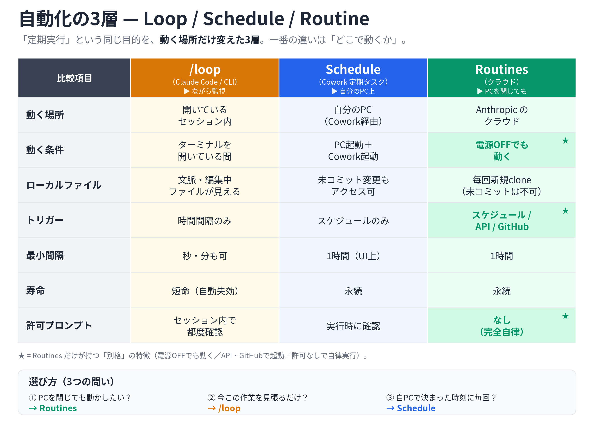

# レベル12 — 自動化の「3層」を理解する：Loop / Schedule / Routine

**ねらい**: 「Claude にくり返し・定期的に作業させる」自動化には、**動く場所の違う3つの層**がある。①Cowork/デスクトップの **定期タスク（Schedule）**、②Claude Code（CLI）の **`/loop`**、③Anthropic クラウドの **Routines**。この3つの違いを比較表で腹落ちさせたうえで、**ハンズオンでは「Cowork の Schedule（この画面で完結）」か「Code の `/loop`・`/schedule`（Codeタブで実行）」かをユーザーに確認して分岐**する（Step 2.5）。既定はいちばん安全で確実に動く Cowork Schedule。Routines は「いつ・なぜ使うか」をコマンド付きで紹介する。

**運用**: ハンズオンに入る前に、Claude は必ず**「どちらを体験するか」を明示的に宣言し、ユーザーに確認する**（Step 2.5）。選択肢は2つ:

- **(A) Cowork の Schedule（このデスクトップ画面で完結）** … Claude がこの画面の中でそのまま定期タスクを設計・試走・登録まで進める。**非エンジニア向けの既定ルート**。
- **(B) Claude Code の `/loop`・`/schedule`（Desktop版のCodeタブで実行）** … Claude はコピペできる短いタスク文を提示し、ユーザーに **Desktop版のCodeタブを開いて貼り付け・実行**してもらう。Claude 自身はこの画面から Code を起動できないため、実行はユーザーが行う。**なお `/schedule`（＝クラウドのRoutine）は「プロンプト＋1つ以上のリポジトリ＋コネクタ」が基本形で、GitHub／リポジトリの利用が前提**（初回は `/web-setup` が必要）。リポジトリを使わない個人向け定期実行（例: カレンダー→Gmailブリーフィング）は (A) の Cowork Schedule 向き、と最初に伝える。

**(A) を選んだ場合は Claude がそのまま進行**し、**(B) を選んだ場合はコピペ用タスクの提示に徹する**。どちらを選んでも、Step 1〜2 の「3層の地図・比較表」の解説は共通で先に行う。レベル9（朝のブリーフィング）の発展回として位置づけると流れが良い。

**所要時間**: 約20分。

---

## ⚠️ まず伝える「同じ目的・違う場所」という地図

3つは別々の機能ではなく、**「定期実行」という同じ目的を、別の場所で解決する3層**と捉えると整理しやすい。最初にこの一言を伝える:

- **Schedule（Cowork/デスクトップの定期タスク）** … **自分のPC上**で動く。電源ONかつ Cowork 起動が必要。
- **`/loop`（Claude Code / CLI）** … **いま開いているセッションの中**で動く。ターミナルを閉じると止まる。一時的。
- **Routines（クラウド）** … **Anthropic のクラウド**で動く。**PCが落ちていても**動く唯一の手段。ただし **`/schedule` で作るRoutineはGitHub／リポジトリの利用が前提**（プロンプト＋1つ以上のリポジトリ＋コネクタが基本形）。

> 「**ラップトップを閉じても動かしたいか？**」「**今この瞬間の作業を見張りたいだけか？**」——この2つで、ほぼ使い分けが決まる、と先に予告する。あわせて「**Codeの `/schedule` はGitHub前提**、リポジトリを使わない個人用途はCowork Scheduleが素直」と冒頭で釘を刺しておく。

---

## Claude への指示

各ステップで「何のために何をするか」を1行説明してから進める（学びが目的）。**Step 1〜2 の解説は飛ばさない**——ここが理解の核。ハンズオン（Step 3）の成果物は参加者の作業フォルダ／定期タスクとして残す。

### Step 0. つかみ（解説）

1行で伝える: 「“毎朝これやっておいて”や“テストが通るまで直し続けて”のような**くり返し作業を Claude に任せる**のが自動化です。やり方が3つあり、**どこで動くか**が一番の違いです」。
そのうえで上の「3層の地図」を一度提示してから先へ進む。

### Step 1. 3層の比較表（★核）

**まず下の図を `present_files` で参加者に見せ**、ひと目で全体像を掴んでもらってから口頭補足に入る（色分け：loop=オレンジ／Schedule=青／Routines=緑。★＝Routinesだけの「別格」特徴）。



図を見せたうえで、列ごとに1〜2点だけ口頭補足する（テキスト版は下表）。

| | `/loop`（CLI） | Schedule（Cowork/デスクトップ定期タスク） | Routines（クラウド） |
|---|---|---|---|
| **動く場所** | 開いているセッション内 | 自分のPC（Coworkアプリ経由） | Anthropic のクラウド |
| **動く条件** | ターミナル/セッションを開いている間 | PCが起動し Cowork が立ち上がっている | **PCの電源が切れていても動く** |
| **ローカルファイル** | 会話の文脈・編集中ファイルが見える | 未コミット変更を含むローカルに**アクセス可** | 毎回リポジトリを新規clone（未コミット変更は見えない） |
| **トリガー** | 時間間隔のみ | スケジュールのみ | **スケジュール / API / GitHub**（併用可） |
| **最小間隔** | 秒・分単位も可 | UI上は1時間単位 | 1時間 |
| **寿命** | 一定期間で自動失効（短命） | 永続 | 永続 |
| **許可プロンプト** | セッション内で都度確認 | 実行時に動く | **なし（完全自律実行）** |

> 補足する観察ポイント: ①「動く条件」の行が使い分けの軸。②Routines だけが「電源OFFでも動く」「API/GitHubでも起動できる」「許可なしで最後まで走る」という3点で別格。③`/loop` は短命で“ながら監視”向き。

### Step 2. それぞれの特徴（短く）

**`/loop` — セッション限定の「ながら監視」**
背景でセッションを開いたまま動き、ターミナルを閉じるとキャンセルされる。各反復で**あなたの文脈・編集中ファイル・会話全体**を見られるのが強み（クラウドのcronには真似できない）。テスト→修正→再テストの反復や、デプロイ監視などの**短期ポーリング**向き。長時間動かすと会話の文脈が膨らみ品質が落ちうるため、長期運用には Schedule か Routines を使う。
> 自動失効までの期間は情報源で記述が分かれる（数日〜1週間程度）。長期間の常時運用は想定しない、と添える。

**Schedule（Cowork/デスクトップ定期タスク） — ローカル環境ごと使える**
最大の利点は**自分のマシンと実ファイル（未コミット変更を含む）をそのまま使える**こと。プッシュ前のコードにテストを回す、ローカルのMCPを使う、といった Routines にできない作業ができる。**ただしPCがスリープ/終了している時刻には動かない**（スリープ復帰時に“見逃した最新1回分だけ”キャッチアップ実行される場合がある——見逃したすべてではない）。

**Routines — クラウドで「マシンが切れていても」動く唯一の手段**
「プロンプト＋1つ以上のリポジトリ＋コネクタ群」を一度パッケージ化して自動実行する保存済み設定。Anthropic 管理のクラウドで動くため、寝ている間・外出中・電源OFFでも動く。決定的な2点は、(1)**トリガーの多様さ**（スケジュール／API（per-routineのHTTP POST）／GitHubイベントを重ねがけ可）、(2)**完全自律実行**（Yes/Noの許可ポップアップなしで最後まで走る＝プロンプトが明確でないと意図しない動作の恐れ）。
> ⚠️ **必ず伝える実行上限**: Routines には、通常の使用量予算とは**別枠で「アカウントあたり24時間で5回まで」**という実行回数の上限がある。**これは最重要の制約**——「毎時間チェックさせる」「PRごとに何十回も走らせる」といった高頻度の使い方はこの枠ですぐ尽きる。Routines は“**1日数回の、本当に自動化したい要所**”に絞って使う、と強調する。
>
> その他の注意: 毎回新規cloneから始まり**実行間で状態を記憶しない**ため、状態を持たせたいならリポジトリ内ファイルや外部サービスに自分で書き出す。1回の実行は通常セッションと同じ使用量予算も消費する。

> `/schedule` の位置づけ（混乱しやすい点）: CLI の `/schedule` は独立した4つ目の仕組みではなく、**Routine を作るためのコマンド**。アクティブな Claude Code セッションから“スケジュールのみの Routine”を作り、API・GitHub トリガーは後から Web 側で足す。なお古い文脈では Cowork/デスクトップの「Schedule」がローカルの定期タスクを指すこともあり、ここが言葉の混乱の元、と一言補足する。

### Step 2.5. 【必須・分岐】どちらを体験するか宣言して確認する（★ここで進路を決める）

比較表で全体像を掴んだ直後、**ハンズオンに入る前に必ず一度立ち止まり**、Claude は次のように**明示的に宣言してから AskUserQuestion で確認**する。

> 宣言（口頭で伝える）: 「ここから手を動かします。**同じ“定期実行”でも動かす場所が2つ**あります。**(A) このCowork画面の中で完結する Schedule** と、**(B) Desktop版のCodeタブで動かす `/loop`・`/schedule`** です。**(A) は私（Claude）がこのままこの画面で作れます。(B) は私からはCodeを起動できないので、コピペ用のタスクをお渡しし、あなたにCodeタブで実行してもらう形**になります。どちらを体験しますか？」

**AskUserQuestion（2択）**:
- **A. Cowork の Schedule（この画面で完結・おすすめ）** — Claude がそのまま設計→試走→登録まで進める。外部の操作は不要。
- **B. Claude Code の `/loop`・`/schedule`（Codeタブで実行）** — Claude はコピペ用タスクを提示。ユーザーが Desktop版のCodeタブで実行する。

分岐:
- **Aを選んだら → Step 3（Cowork Schedule ハンズオン）へそのまま進む。**
- **Bを選んだら → Step 3B（Code `/loop`・`/schedule` コピペ実行）へ進む。** Step 3（Cowork）はスキップしてよい。

> 迷ったら A を勧める（非エンジニアが確実に成果を持ち帰れるのは Cowork Schedule）。B は「CLIに触れてみたい」「Codeタブを使ってみたい」人向けの発展ルートと位置づける。

### Step 3. ハンズオン — 「Schedule（定期タスク）」を1つ実際に作る（Cowork内で完結）

**（Step 2.5 で A を選んだ人向け。B を選んだ人は Step 3B へ）**


3層のうち**いちばん安全で確実に動く Schedule** を、その場で1つ作って体感する。レベル9（朝のブリーフィング）を済ませた人は、その内容を流用してよい。

1. **何を定期実行するか決める**（AskUserQuestion）。重ための準備をせず1分で出力が出るものにする。デモ用おすすめ:
   - **A. カレンダー→Gmailブリーフィング（おすすめ）** — 平日朝、今日のGoogleカレンダー予定（カレンダーMCP）を確認し、要点を3行にまとめて**Gmailで自分宛に送る／下書きにする**。「リポジトリを使わない個人向け定期実行」の代表例で、まさに Cowork Schedule の得意技。
     > 補足で一言: 公式Gmailコネクタは**下書き作成まで（送信は手動クリック）**。自動送信までしたい場合は送信可能なMCP（gogcli等）を使う、と伝える。
   - **B. ミニ・ブリーフィング** — その日の予定（カレンダーMCP）か、関心分野の新着論文（PubMed）を**リンク付き**で短く要約。
   - **C. リマインダー** — 「今日やることを3つ挙げて声かけする」程度の軽いもの（外部MCP不要で確実に動く）。
2. **まず“今すぐ試走”して出力を見る**（重要）。スケジュール登録の前に、設計した中身を**手動で1回**走らせ、出力イメージを参加者に見せて1〜2点だけ調整する。「登録したのに中身が思っていたのと違う」を防ぐ。
3. **定期タスクとして登録**する。実行時刻は**参加者がふだんPCを開いている時間帯**にする（制約: PC ON＋Cowork起動が条件）。デフォルト例: 平日 朝8:00。
4. 登録内容（タイミング・やること）を1行で要約して確認し、**制約を一言**: 「この時刻にPCが起動＆Cowork起動中なら自動実行。落ちていればスキップされます」。
5. 既存タスクの**確認・変更・停止**もできると伝える（「登録した定期タスクを止めて／時刻を変えて」で調整可）。

> ここで作る Schedule が、表の「Schedule」列を実体験する部分。Aを選んだ場合の論文収集は、MeSHで検索式→`count`で件数検証→期間限定で取得→第一著者・雑誌・年・**PubMedリンク**付与、の作法を守る。

### Step 3B. ハンズオン — 「Code の `/loop`・`/schedule`」をコピペで実行する（Codeタブで）

**（Step 2.5 で B を選んだ人向け。A を選んだ人は Step 3 を実施済みなのでここは飛ばす）**

Claude はこの画面から Code を直接起動できない。そこで **Claude が「コピペできるタスク文」を提示し、ユーザーが Desktop版の Code タブを開いて貼り付け・実行する**。Claude の役割は「渡す・見守る・結果を一緒に読む」まで。

進め方（Claude が案内する）:

1. **やりたいことを1つ決める**（AskUserQuestion）。1分で結果が出る軽いものにする。
   - **`/loop` 向け（短い見張り）**: 「テストが通るまで直し続ける」「ファイルの変化を監視して知らせる」など、**今このセッションで反復**したいもの。
   - **`/schedule` 向け（定期実行のRoutine化）**: 「毎朝このリポジトリのPRレビュー要約を作る」など、**保存して定期実行**したいもの。
2. **Claude がコピペ用タスク文を提示する**（下のテンプレをその場の内容に置き換えて出す）。ユーザーはこれをそのままコピーする。
3. **「Desktop版のCodeタブを開いて、貼り付けて実行してください」と口頭で案内**する。Claude は起動できないので、タブ切り替えと実行はユーザーが行う。
4. 実行後、**出力をこの画面に貼り戻してもらい**、Claude が一緒に読んで1〜2点コメントする。
5. `/schedule` を使った場合は「これで“スケジュールのみのRoutine”ができた。API/GitHubトリガーは後からWebで足せる」「**24時間に5回まで**の実行上限に注意」と添える。

**コピペ用テンプレ①（`/loop`：短い見張り）** — Codeタブに貼る:

```
このテストが全部通るまで、修正→再実行をくり返して。通ったら止めて。
```

**コピペ用テンプレ②（`/schedule`：定期実行のRoutine化）** — Codeタブに貼る:

```
/schedule
毎朝このリポジトリのPRレビュー要約を作るRoutineを作りたい。スケジュールのみでよい。
```

> 注意として一言添える: `/loop` はターミナル/セッションを閉じると止まる“その場限り”。`/schedule` で作った Routine は永続だが、状態は記憶せず毎回新規cloneから始まり、**実行上限（24時間で5回）**がある。高頻度用途には向かない。

### Step 4.（紹介）`/loop` — 今この作業を見張りたいとき

> 対象: **Step 2.5 で A（Cowork Schedule）を選んだ人向けの“紹介”**。B を選んだ人は Step 3B で実際に触れているので、ここは軽く流してよい。

ここは**動かさず紹介に留める**（CLIが必要なため）。Claude Code（レベル10）を開いている人向けに、こう使う、とコマンドだけ示す。

```
（Claude Code のセッション内で）
このテストが全部通るまで、修正→再実行をくり返して。通ったら止めて。
```

観察ポイント: `/loop` 的な反復は**開いているセッションの文脈を見ながら**回るのが価値。ターミナルを閉じれば止まる“その場限り”。長く回すより、**短い見張り**に使う。

### Step 5.（紹介）Routines — PCを閉じても動かしたいとき

これも**紹介に留める**（クラウド側UI/Webでの設定が必要なため）。一言: 「**電源が切れていても動かしたい**、**APIやGitHubイベントで起動したい**、なら Routines」。

```
（Claude Code のセッション内で）
/schedule
→ 毎朝このリポジトリのPRレビュー要約を作る Routine を作りたい
```

観察ポイント: `/schedule` で**スケジュールのみのRoutine**ができ、API/GitHubトリガーは後からWebで足す。完全自律で走るので**プロンプトを明確に**。状態は記憶しないので必要なら自分で書き出す。そして**「24時間に5回まで」の実行上限**があるため、高頻度の用途には向かない——“1日数回の要所”に絞る、と必ず添える。

### Step 6. まとめ — 3問で選べる早見

最後に「選び方」を3つの問いで締める。

1. **PCを閉じても動かしたい？** → はい＝**Routines** ／ いいえ＝次へ
2. **今この瞬間の作業（編集中ファイル）を見張りたいだけ？** → はい＝**`/loop`** ／ いいえ＝次へ
3. **自分のPC上で、決まった時刻に毎回やってほしい？** → **Schedule（定期タスク）**

> 締めの一言: 「非エンジニアの日常自動化は、まず**Schedule（定期タスク）**で十分。CLIを使うなら短い見張りに**`/loop`**、本格的に“留守でも回す”なら**Routines**へ広げる、という順で覚えると迷いません」。

完了後「次はどのレベルを体験しますか？」と尋ね、`00_START` の Phase 1 に戻る。
